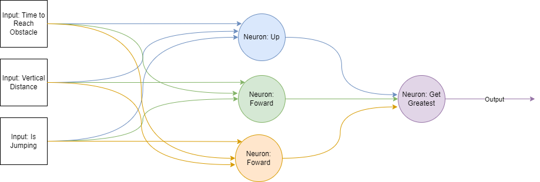
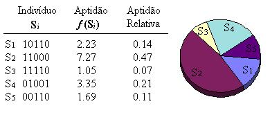
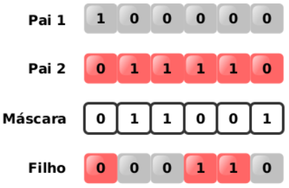

# Sobre o Projeto

Este projeto foi feito usando o código do repositório [chrome-trex-rush](https://github.com/turing-usp/chrome-trex-rush). O jogo do dinossauro é replicado nele usando a bilbioteca [Pygame](https://www.pygame.org). O chrome-trex-rush implementa a parte visual do jogo, além de permitir simular o jogo para vários dinossauros. Para cada frame do jogo, é possível obter o seu estado atual (informações sobre obstáculos, velocidade atual do jogo, etc) e deve-se informar uma ação(pular, agachar ou andar) para cada dinossauro para que se possa ir para o próximo frame.

Este projeto implementa um algoritmo genética para aprender o jogo. Cada dinossauro é representado por uma rede neural de 2 camadas. A 1º camada é composta por 3 neurônios referentes às 3 possíveis ações que recebem 3 entradas referentes ao tempo para alcançar(distância dividida pela velocidade do jogo) e posição vertical(posição vertical tendo o chão como referencial subtraida pela altura dinossauro) do próximo obstáculo e o valor numérico referente a estado lógico do dinossauro estar pulando ou não(1 para verdadeiro e 0 para falso). As saídas destes 3 neurônios são a entrada de 4º neurônio que irá selecionar a saída com maior valor e escolher a respectiva ação.



# Parâmetros

Os parâmetros de treinamento podem ser alterados no arquivo `trainning_params.py`. Nele, pode-se definir o peso e viés mínimo/máximo dos neurônios, quantidade de indivíduos da população, número de gerações e taxas de cruzamento e mutação.

## Exemplo de Arquivo `trainning_params.py`

```python
dino_count = 300
num_gens = 1000
crossover_rate = 0.6
mutation_rate = 0.2

min_weight = 0
max_weight = 10
min_bias = -1
max_bias = 1
num_inputs = 3
```

# Algoritmo Genético

## Fitness

O *fitness* de cada indivíduo será a sua pontuação no final de cada partida(o quão longe ele chegou).

## Seleção por Roleta

Após o fim da geração, a população será totalmente substituida através da escolha de indivíduos da população anterior. A chance de um indivíduo ser escolhido equivale ao percentual do seu *fitness* em relação à soma dos *fitnessess* da população, ou seja, indivíduos com maior *fitness* tenderão a ser mais escolhidos.



## Cruzamento Uniforme

Cada cruzamento irá gerar 2 filhos. Para cada cruzamento é gerado uma máscara aleatória de 3 dígitos binários referentes aos 3 neurônios de camada 1. Caso a máscara seja 0, o 1º filho irá herdar o neurônio equivalente do 1º pai e o 2º filho irá herdar o neurônio do 2º pai. Caso a máscara seja 1, ocorre o inverso.



## Mutação

Para cada indivíduo, tenta-se aplicar uma mutação 3 vezes, uma para cada neurônio de camada 1. A mutação equivale a gerar novos pesos e viés aleatórios ao neurônio.

# Notas do Código do chrome-trex-rush

## Ações Quando o Dino Está no Ar

No código original, não há nenhuma alteração no movimento do dinossauro quando ele tenta se agachar ou pular estando no ar. Alteramos o código de forma que, se ele se agachar no ar, ele irá cair mais rápido e, se ele tentar pular no ar, ele irá cair mais lentamente. Isso permite que o dino aprenda estratégias como se agachar ao passar de um obstáculo para chegar mais rápido ao chão e poder pular o próximo obstáculo mais rápido.

## Limitações do chrome-trex-rush

A principal limitação encontrada no código do chrome-trex-rush está relacionada à forma que os obstáculos são gerados. Em alguns momentos são gerados cactos e pterodáctilo muito próximos, de forma que é impossível desviar, fazendo com que dinos promissores morressem cedo demais. Além disso, em alguns momentos é gerado apenas cactos por boa parte do percurso, fazendo com que dinos que só sabem desviar do cacto mas não do pterodáctilo ganhem scores muito altos. Estas limitações causaram um atraso o aprendizado dos dinos.

# Executando o Código

## Instalando Dependências

`poetry install`

## Rodando Treinamento

`poetry run train`

Sempre que o código encontrar um indivíduo que bateu o recorde do jogo de treinamento, ele irá exportar o arquivo `dino_params.txt` com as informações dos pesos e viéses de seus neurônios. Este arquivo será usado posteriormente no comando `poetry run play` para criar o dinossauro.

### Exemplo de Arquivo `dino_params.txt`

```
[2.98350607 2.11769848 7.13659417]
-0.39448118138819743
[6.63418138 2.52645824 0.75304239]
-0.43207310735713267
[0.83442417 8.40866032 4.36345151]
-0.6679732398869809

```

## Jogando com Melhor Indivíduo

`poetry run play`
