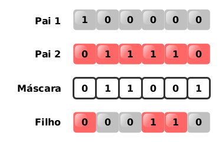

# Sobre o projeto

Este projeto foi feito usando o código do repositório [chrome-trex-rush](https://github.com/turing-usp/chrome-trex-rush). O jogo do dinossauro é replicado nele usando a bilbioteca [Pygame](https://www.pygame.org). O chrome-trex-rush implementa a parte visual do jogo, além de permitir simular o jogo para vários dinossauros. Para cada frame do jogo, é possível obter o seu estado atual (informações sobre obstáculos, velocidade atual do jogo, etc) e deve-se informar uma ação(pular, agachar ou andar) para cada dinossauro para que se possa ir para o próximo frame.

Este projeto implementa um algoritmo genética para aprender o jogo. Cada dinossauro é representado por uma rede neural de 2 camadas. A 1º camada é composta por 3 neurônios referentes às 3 possíveis ações que recebem 4 entradas referentes à distância e posição vertical do próximo obstáculo, velocidade do jogo e valor numérico referente a estado lógico do dinossauro estar pulando ou não(1 para verdadeiro e 0 para falso). As saídas destes 3 neurônios são a entrada de 4º neurônio que irá selecionar a saída com maior valor e escolher a respectiva ação.


# Parâmetros

Os parâmetros de treinamento podem ser alterados no arquivo `trainning_params.py`. Nele, pode-se definir o peso e viés mínimo/máximo dos neurônios, quantidade de indivíduos da população, número de gerações e taxas de cruzamento e mutação.

```
dino_count = 200
num_gens = 50
crossover_rate = 0.5
mutation_rate = 0.1

min_weight = -1000
max_weight = 1000
min_bias = -0
max_bias = 0
num_inputs = 4

```

# Algoritmo Genético

## Fitness

O *fitness* de cada indivíduo será a sua pontuação no final de cada partida(o quão longe ele chegou).

## Seleção por Roleta

Após o fim da geração, a população será totalmente substituida através da escolha de indivíduos da população anterior. A chance de um indivíduo ser escolhido equivale ao percentual do seu *fitness* em relação à soma dos *fitnessess* da população, ou seja, indivíduos com maior *fitness* tenderão a ser mais escolhidos.


## Cruzamento Uniforme

Cada cruzamento irá gerar 2 filhos. Para cada cruzamento é gerado uma máscara aleatória de 3 dígitos binários referentes aos 3 neurônios de camada 1. Caso a máscara seja 0, o 1º filho irá herdar o neurônio equivalente do 1º pai e o 2º filho irá herdar o neurônio do 2º. Caso a máscara seja 1, ocorre o inverso.



## Mutação

Para cada indivíduo, tenta-se aplicar uma mutação 3 vezes, uma para cada neurônio de camada 1. A mutação equivale a gerar novos pesos e viés aleatórios ao neurônio.

# Executando o código

## Instalando dependências

`poetry install`

## rodando treinamento

`poetry run train`

Sempre que o código encontrar um indivíduo que bateu o recorde do jogo de treinamento, ele irá exportar o arquivo `dino_params.txt` com as informações dos pesos e viéses de seus neurônios. Este arquivo será usado posteriormente no comando `poetry run play` para criar o dinossauro.

## Jogando com melhor indivíduo

`poetry run play`
