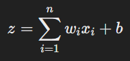
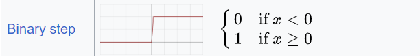
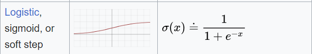
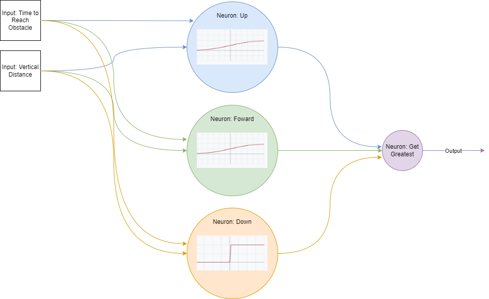

# Sobre o Projeto

Este projeto foi feito usando o código do repositório [chrome-trex-rush](https://github.com/turing-usp/chrome-trex-rush). O jogo do dinossauro é replicado nele usando a bilbioteca [Pygame](https://www.pygame.org). O chrome-trex-rush implementa a parte visual do jogo, além de permitir simulá-lo com vários dinos. Para cada frame do jogo, é possível obter o seu estado atual (informações sobre obstáculos, velocidade atual do jogo, etc) e deve-se informar a ação(pular, andar ou agachar) de cada dino para que se possa ir para o próximo frame.

Este projeto implementa um algoritmo genética. Cada dino é representado por uma rede neural de 2 camadas. A 1º camada é composta por 3 neurônios referentes às 3 possíveis ações que recebem 2 entradas, sendo elas:

* Tempo normalizado para chegar ao próximo obstáculo: distância entre o dino e o próximo obstáculo dividida pelo produto entre o comprimento da tela e a velocidade atual do jogo
* Distância vertical normalizada: Diferença entre a posição vertical do dino e do próximo obstáculo dividada pela altura da tela

As saídas destes 3 neurônios são a entrada de 4º neurônio que irá selecionar a saída com maior valor e escolher a respectiva ação. As funções de ativação dos neurônios de pular e andar são a sigmoide enquanto a do neurônio de agachar é o degrau binário.









Note que a sigmoide sempre irá gerar uma valor entre 0 e 1 e o degrau sempre será 0 ou 1. Pelo fato da função de ativação do neurônio de agachar ser o degrau, esta ação sempre irá possuir prioridade caso seus inputs gerem uma soma não negativa. De forma análoga, caso seus inputs gerem uma soma negativa, este neurônio irá gerar uma saída 0, fazendo com que as outras ações tenham prioridade.

# Parâmetros

Os parâmetros de treinamento podem ser alterados no arquivo `trainning_params.py`. Nele, pode-se definir o peso e viés mínimo/máximo dos neurônios, quantidade de indivíduos da população, número de gerações e taxas de cruzamento e mutação.

## Exemplo de Arquivo `trainning_params.py`

```python
dino_count = 100
num_gens = 1000
crossover_rate = 0.6
mutation_rate = 0.2

min_weight = -10
max_weight = 10
min_bias = -1
max_bias = 1
num_inputs = 2
```

# Algoritmo Genético

## Fitness

O *fitness* de cada indivíduo será a sua pontuação no final de cada partida(o quão longe ele chegou).

## Seleção por Roleta

Após o fim da geração, a população será totalmente substituida através da escolha de indivíduos da população anterior. A chance de um indivíduo ser escolhido equivale ao percentual do seu *fitness* em relação à soma dos *fitnessess* da população, ou seja, indivíduos com maior *fitness* tenderão a ser mais escolhidos.


## Cruzamento Uniforme

Cada cruzamento irá gerar 2 filhos. Para cada cruzamento é gerado uma máscara aleatória de 3 dígitos binários referentes aos 3 neurônios de camada 1. Caso a máscara seja 0, o 1º filho irá herdar o neurônio equivalente do 1º pai e o 2º filho irá herdar o neurônio do 2º pai. Caso a máscara seja 1, ocorre o inverso.


## Mutação

Para cada indivíduo, tenta-se aplicar uma mutação 3 vezes, uma para cada neurônio de camada 1. A mutação equivale a gerar novos pesos e viés aleatórios ao neurônio.Notas do Código do chrome-trex-rush

# Limitações do chrome-trex-rush

A principal limitação encontrada no código do chrome-trex-rush está relacionada à forma que os obstáculos são gerados. Em alguns momentos são gerados cactos e pterodáctilos muito próximos, de forma que é impossível desviar, fazendo com que dinos promissores morram cedo demais. Além disso, em alguns momentos é gerado apenas cactos por boa parte do percurso, fazendo com que dinos que só sabem desviar do cacto mas não do pterodáctilo ganhem scores superestimados. Estas limitações causam um atraso no aprendizado dos dinos.

# Executando o Código

## Instalando Dependências

`poetry install`

## Rodando Treinamento

`poetry run train`

Sempre que o código encontrar um indivíduo que bateu o recorde do jogo de treinamento, ele irá exportar o arquivo `dino_params.txt` com as informações dos pesos e viéses de seus neurônios. Este arquivo será usado posteriormente no comando `poetry run play` para criar o dinossauro.

### Exemplo de Arquivo `dino_params.txt`

```
[-7.93148662  1.34297385]
0.7192595492470872
[0.89884438 0.64064279]
0.5173627876963991
[ 4.98639947 -7.16036658]
-0.9064276834816818

```

## Jogando com Melhor Indivíduo

`poetry run play`

# Vídeos de Treinamento

## Início do treinamento


## Decorrer do Treinamento


## Fim do Treinamento


